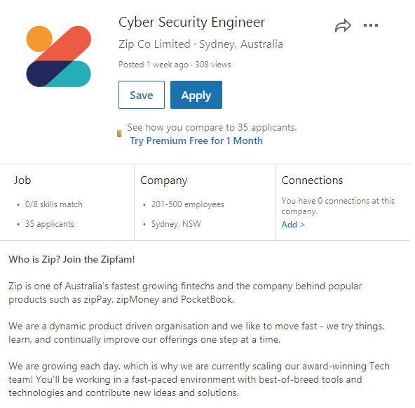

# Personal Details

-Name Vincent Singzon

-Student Number 

-Email Address singzon111@gmail.com

-Basic Background 
My name is Vincent and my nationality is Australian and my background is Filipinob born in Saudi Arabia and i only speak English at home My education to date includes completion of my Year 12 School Cetrificate at Patrician Brothers Blacktown and a Cert III course in Networking at Blacktown Tafe. My Hobbies include things like Gaming, drawing, going to the gym. I have also travelled to countries  USA, Japan and Europe, China, Vietnam. 


# Interest in IT

My interest in IT is in Cyber Security i have been told it's job that's in high demand. My interest in IT started because i have always had a fascination with Technology like computers and my hobbies like gaming made me want to work in IT related field, also my dad works as a programmer and i have always wanted to be like him working in IT.

I chose to come to RMIT as i was browing online courses to study in IT Cyber Security and i found an advertisement in open university about an online course at RMIT University. I expect to learn many different things related to IT such as programming, networking, cybersecurity and gain experience working.


Syntax highlighted code block

# Ideal Job




The position is 


### Header 3

- Bulleted
- List

1. Numbered
2. List

**Bold** and _Italic_ and `Code` text

[Link](url) and 
```

For more details see [GitHub Flavored Markdown](https://guides.github.com/features/mastering-markdown/).

### Jekyll Themes

Your Pages site will use the layout and styles from the Jekyll theme you have selected in your [repository settings](https://github.com/VincentSingzon/myprofile/settings). The name of this theme is saved in the Jekyll `_config.yml` configuration file.

### Support or Contact

Having trouble with Pages? Check out our [documentation](https://help.github.com/categories/github-pages-basics/) or [contact support](https://github.com/contact) and we’ll help you sort it out.
