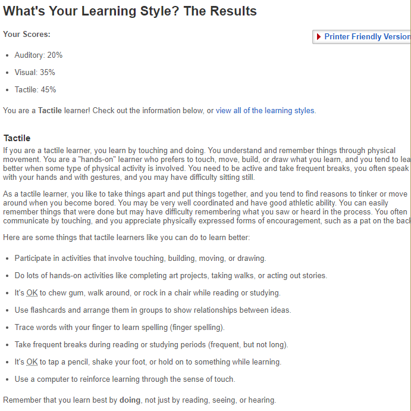
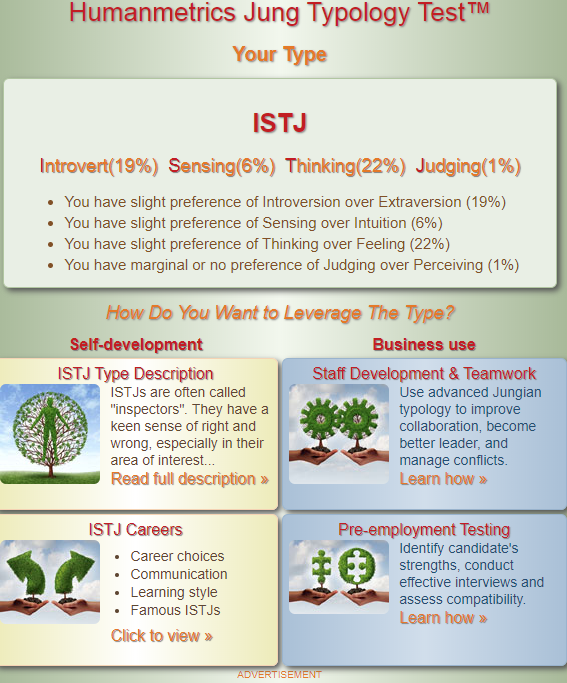
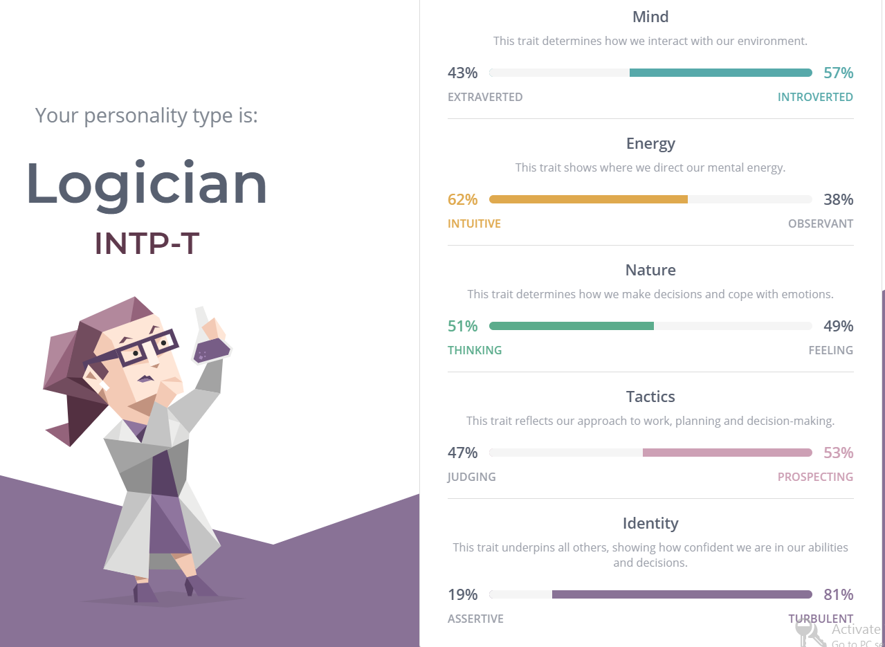

# Personal Details

-Name Vincent Singzon

-Student Number 

-Email Address singzon111@gmail.com

-Basic Background 
My name is Vincent and my nationality is Australian and my background is Filipinob born in Saudi Arabia and i only speak English at home. My education to date includes completion of my Year 12 School Cetrificate at Patrician Brothers Blacktown and a Cert III course in Networking at Blacktown Tafe. My Hobbies include things like Gaming, drawing, going to the gym. I have also travelled to countries  USA, Japan and Europe, China, Vietnam. 

# Interest in IT

My interest in IT is in Cyber Security i have been told it's job that's in high demand. My interest in IT started because i have always had a fascination with Technology like computers and my hobbies like gaming made me want to work in IT related field, also my dad works as a programmer and i have always wanted to be like him working in IT.

I chose to come to RMIT as i was browing online courses to study in IT Cyber Security and i found an advertisement in open university about an online course at RMIT University. I expect to learn many different things related to IT such as programming, networking, cybersecurity and gain experience working.

# Ideal Job

The position is IT Security Analyst to work on a full time basis working in a fast pased enviroment with commercial and opensource technologies and contributing to new ideas and solutions managing and trouble shooting security related technical issues, managing security of office technology including workstations, firewall switches and wifi and other things. 

The position is highly appealing to me as it has a high salary plus super, a state of the art office in the CBD with the offices fitted with the latest technology and tools. Flexible working hours and working at home, friday massages and social events on Friday amd chance to win $500 per month.

The skills that would be needed is experience with Cyber Security, ability to communicate effectively to diverse stakeholder group,SIEM experience, problem solving and analytical skills and Windows/Linux secuirty experience, Industry Certfications like CISM, CEh and GSEC and a Bachelors degree in Information Technology.

The skills i currently have right now is studying a Bachelors degree, the ability to communicate and ability to manage time effectively.

My plant to obtain these skills will be studying Information Technology and Cyber Security, meeting people who work in this industry making connections with them at Linkdin, studying, and going to confrences

# Personal Profile

Learner test results

Myers-Briggs Type Indicator (MBTI) test results

The results of the online test of my chosing

- The results mean i'm someone who tries to think logically and try to solve problems by using a hands on approach to things such as drawings or someone desmonstrating something to me. And having a habit of walking around thinking of things and imagining scenarios in my head. Often taking frequent breaks walking around when studying or working. Also being a bit introverted and trying to do tasks on my own.

- The results influences my behaviour when working in a team as i often tend to imagine things whenever we have a discussion about things and makes it hard for me to keep track of the task hand, also trying to come up with logical ideas that may help them when were having a problem that needs solving.

- I'll take it into account by trying to focus on my strenghs and trying to be part of a group and trying to tasks which i'm more best suited trying to do tasks which i'm more comfortanble with doing.

# Project Idea

## Overview
My idea of a project would be the development of a videogame using engine tools like Unity or Unreal engine as videogames have always been a passion of mine every since i was a kid. The project would be a roguelike videogame where you play as an explorer entering a abandoned world where you have to survive and find out what happened to the place. There would be weapons and vehicles that the player could utlize and items that the player could craft in order to survive. The game would also have two difficulty modes hardcore and casual, with hardcore only being able to have one life losing all items and progress and having to restart the game again after death and casual being able to retain items and progress after death.

## Motivation
I think the game is important to me as wanting to make videogames has been a passion of mine and i want other to experience that same passion i have of gaming to others. The game i would be making would be considered enjoyable to others as far as indie games are considered roguelikes are a popular genre but this game would also be able to accomidate more casual players who play mostly for story and would not like to have lose progress after hours of playing. Catering to both hardcore and casual gamers would be useful for generating revenue that would otherwise not be made had it catered for only a niche market.

## Description 
The game would feature many staples of Roguelike games such as permadeath, hardcore difficulty, secrets, and items that can be bought from venders in this case vending machines or robots. The game would also have more easy options for more casual players that don't want to do things like grind for items, level up and instead would prefer to enjoy the story. Another feature that the game would also have is multiplayer with options to create private servers, and having tools to modify or create maps of there own. The product will not have any levels in the traditional sense but randomly generated areas that changes with each playthrough so items that could appear in hard to reach areas in one game could be in areas which are close to the start of the game or sometimes having harder enemies spawn. The game also would have a day and night cycle with more tougher enemies appearing at night and more easier enemies during the day but in areas which are dimly lit such as caves and or underground shelters, tunnels spawning enemies such as bosses and spawning very rare items that can prove to be a challenge and make players choose to decide weather they would take the risk for an item that could help them later on or not do and do challenges which are less riskier but also less rewarding to them. And there being planned features that i would also consider to add in future later updates. 

## Tools and Technologies 

The software that would be need to make this project would be things such as a powerful computer that would be used to do things such as rendering and creating assests, a comfortable chair, some books and or website links on how to program and use game engines such as Unity. The use of open source tool Unity would be used as it is well known and available for free has powerful tools that are fairly easy to use and has been used in other games that have been well recived and are well known. Other software needed would be audio software which will be used to impliment sounds and music. 

## Skills Required

The skills that i would require for my project would be skills such as the programming knowledge of languages such as c#, java or c++, knowledge of tools such as Blender or other programs creating game assests and animating characters. knowledge of audio like making music, voice acting or creating ambient sounds and sound effects. The skills would require me to study a lot to achieve these skills and would require me to have help with sound design or art if the project is too difficult.

## Outcome 

The project if successful would have me gain more experience and knowledge with the use of the tools and languages that i would be using for this project and possibly generate interest in creating a sequel or other gaming related projects.
